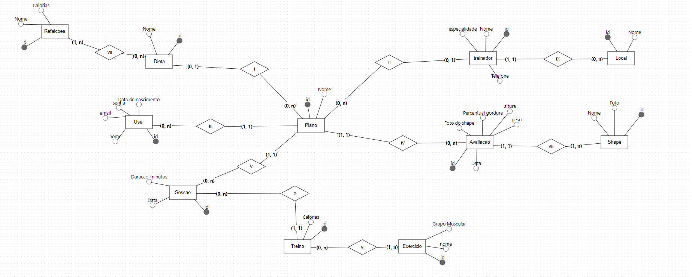
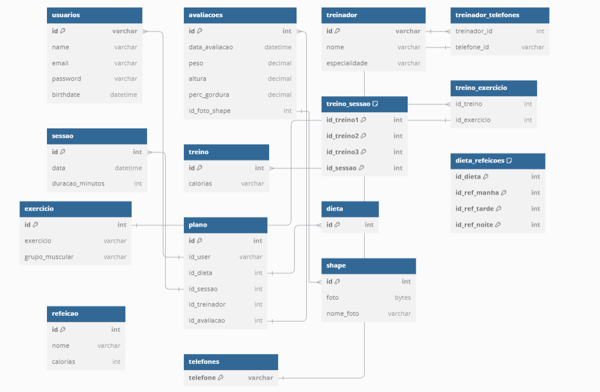
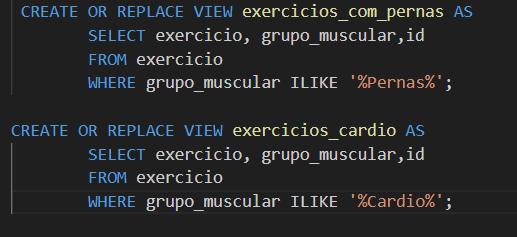
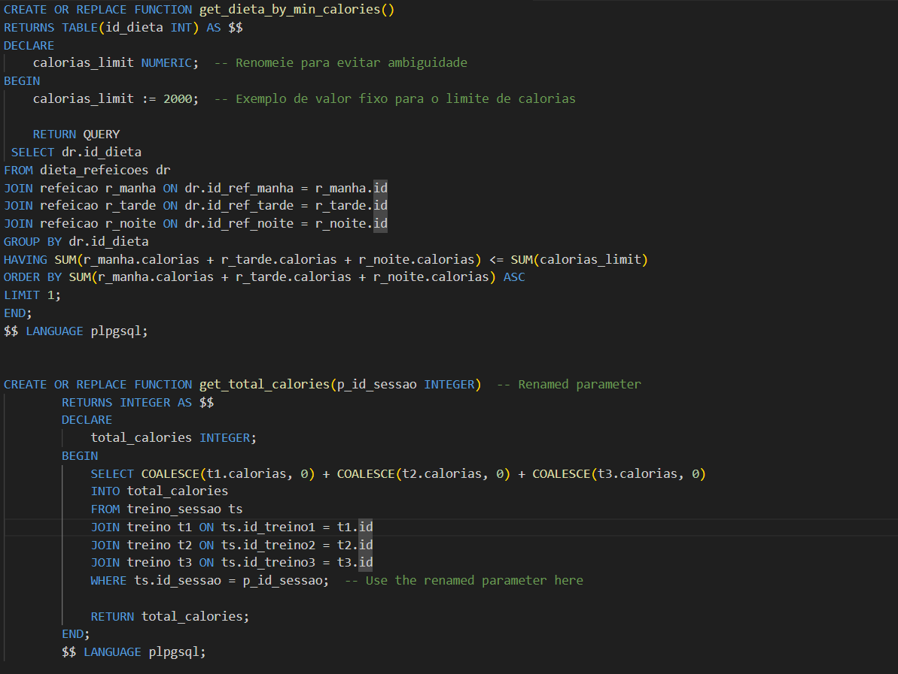

# README do Projeto de Banco de Dados Gym Fitness

## Descrição

Este projeto é um aplicativo de Gym Fitness desenvolvido usando FastAPI. O objetivo principal do sistema é gerenciar planos de treino e dieta de usuários, permitindo que treinadores personalizem rotinas e acompanhem o progresso dos seus alunos. O projeto conta com um banco de dados relacional que segue o diagrama entidade-relacionamento (MER) descrito abaixo, com várias entidades interligadas para armazenar informações de usuários, sessões de treino, avaliações, entre outros. Inspirado/Fork do template original do repositóro do fastapi.Veja o template completo do FastAPI em [FastAPI Full Stack Template](https://github.com/fastapi/full-stack-fastapi-template).

## Entidades Principais

- **Plano**: Armazena informações sobre o plano de treino e dieta do usuário.
- **Dieta**: Relacionada aos planos, define as diretrizes alimentares.
- **Usuário**: Representa a pessoa que utiliza o sistema, podendo ter um ou mais planos e avaliações.
- **Sessão**: Conjunto de treinos realizados em uma data específica.
- **Treino**: Composto por exercícios que o usuário realiza em uma sessão.
- **Exercício**: Detalha os exercícios realizados durante o treino.
- **Avaliações**: Acompanha o progresso físico do usuário ao longo do tempo.
- **Treinador**: Profissional que define planos e avalia o progresso do usuário.
- **Shape**: Representação física do usuário com fotos para acompanhamento.
- **Telefone**: Informações de contato dos treinadores.
- **Refeição**: Parte da dieta, contém informações sobre os alimentos que o usuário deve consumir.


## Diagrama Entidade-Relacionamento (MER)

Abaixo está o diagrama entidade-relacionamento (MER) que representa as relações entre as principais entidades do sistema.



## Modelo Relacional (MR)

A seguir está o modelo relacional (MR) do sistema que detalha as tabelas do banco de dados e seus relacionamentos.



## Tecnologias Utilizadas

- **FastAPI:** Framework usado para a criação das APIs.
- **SQLAlchemy:** ORM utilizado para gerenciar as entidades e seus relacionamentos no banco de dados.
- **PostgreSQL:** Banco de dados relacional utilizado para armazenar as informações.

## Como Executar o Projeto

**.** Testado em distribuições Linux (Ubuntu e Debian)

**.** Para acessar o banco de dados internamente, usar dbeaver e as credenciais em .env

**Passo 1:** Instalar Docker e Docker Compose no sistema operacional  
**Passo 2:** Executar o comando “docker compose up --build”  
**Passo 3:** Abrir outra aba do terminal e executar o comando “docker compose exec backend bash”
**Passo 4:** Executar as migrações no alembic, conforme readme na pasta backend
**Passo 5:** Acessar o endereço “localhost/docs” em algum browser para vizualizar a interface fornecida pelo fastapi


## Rotas da API

**Usuário**  
GET /usuarios/: Lista todos os usuários.  
POST /usuarios/: Cria um novo usuário.  
PUT /usuarios/{id}: Atualiza um usuário.  
DELETE /usuarios/{id}: Remove um usuário.

**Treinador**  
GET /treinadores/: Lista todos os treinadores.  
POST /treinadores/: Cria um novo treinador.  
PUT /treinadores/{id}: Atualiza um treinador.  
DELETE /treinadores/{id}: Remove um treinador.

**Plano**  
GET /planos/: Lista todos os planos.  
POST /planos/: Cria um novo plano.  
PUT /planos/{id}: Atualiza um plano.  
DELETE /planos/{id}: Remove um plano.

**Sessão**  
GET /sessoes/: Lista todas as sessões.  
POST /sessoes/: Cria uma nova sessão.  
PUT /sessoes/{id}: Atualiza uma sessão.  
DELETE /sessoes/{id}: Remove uma sessão.

**Treino**  
GET /treinos/: Lista todos os treinos.  
POST /treinos/: Cria um novo treino.  
PUT /treinos/{id}: Atualiza um treino.  
DELETE /treinos/{id}: Remove um treino.


## Consultas ao Banco de Dados
# Criação de viwes
No contexto da criação de views para o projeto, as views são uma poderosa ferramenta no gerenciamento e organização dos dados, permitindo consultas pré-definidas que podem ser reutilizadas facilmente e de maneira eficiente. As seguintes views foram criadas para facilitar o acesso a informações específicas sobre exercícios:



View exercicios_com_pernas: Esta view foi criada para exibir todos os exercícios que estão relacionados ao grupo muscular "Pernas". Ela executa uma consulta na tabela exercicio e retorna apenas os registros em que o campo grupo_muscular contém a palavra "Pernas". A utilização da função ILIKE permite uma busca que não diferencia maiúsculas de minúsculas, tornando a pesquisa mais flexível. Essa view é útil quando o objetivo é visualizar rapidamente os exercícios focados no fortalecimento ou treino das pernas.
View exercicios_cardio: Semelhante à view anterior, esta view foi criada para listar todos os exercícios relacionados ao grupo "Cardio". Ela facilita a consulta de exercícios que envolvem atividades cardiovasculares, extraindo as informações diretamente da tabela exercicio onde o grupo muscular contém a palavra "Cardio". Isso é particularmente útil em situações onde há a necessidade de separar os exercícios de resistência muscular dos aeróbicos para planejamento de treino.

# Procedures
No contexto do sistema de banco de dados do aplicativo Gym Fitness, a criação de stored procedures (ou funções armazenadas) oferece diversos benefícios em termos de eficiência e organização do código SQL. As funções listadas abaixo demonstram como essas rotinas podem otimizar operações recorrentes e simplificar o acesso a dados complexos:



Função get_dieta_by_min_calories:
	Esta função retorna a dieta que contém a menor quantidade de calorias, de acordo com um limite fixo de 2000 calorias. Ela utiliza joins entre as refeições (manhã, tarde e noite) associadas a uma dieta e calcula o total de calorias dessas refeições. O uso dessa função é vantajoso em cenários onde o sistema precisa rapidamente identificar dietas que se enquadrem em uma determinada restrição calórica, tornando a consulta mais eficiente e reutilizável em diversas partes do sistema.
Função get_total_calories:
	Esta função calcula o total de calorias consumidas em uma sessão de treino, somando as calorias dos três treinos realizados nessa sessão. Ao utilizar joins para acessar os treinos associados à sessão, a função retorna o valor total de calorias, facilitando a criação de relatórios de consumo energético. A função é particularmente útil para monitoramento de desempenho dos usuários, já que evita a necessidade de escrever repetidamente a lógica de cálculo de calorias em diferentes consultas.

# Comandos DDL
No sistema de banco de dados do aplicativo Gym Fitness, os comandos DDL (Data Definition Language) desempenham um papel crucial na criação, modificação e exclusão de estruturas de dados como tabelas, índices e chaves primárias ou estrangeiras. Abaixo, descrevemos alguns dos comandos DDL utilizados e seus impactos no banco de dados:
Criação de Tabelas:
A criação de tabelas como dieta, exercício, seção, treinador e outras define a estrutura do banco de dados, especificando os atributos e seus tipos de dados. Cada tabela contém uma chave primária, garantindo a unicidade dos registros, e algumas tabelas possuem restrições de integridade referencial, como as chaves estrangeiras, que asseguram que os relacionamentos entre as tabelas sejam mantidos corretamente.
Índices e Unicidade:
Além da criação de tabelas, um índice único foi definido para o campo email da tabela user, garantindo que não haja duplicação de e-mails no sistema. Esse tipo de restrição é essencial para manter a integridade dos dados, evitando registros duplicados que possam comprometer o funcionamento do sistema.
Relacionamentos e Integridade Referencial:
Diversas tabelas, como dieta_refeicoes, treino_exercicio e plano, utilizam chaves estrangeiras para criar relacionamentos com outras tabelas. As restrições ON DELETE CASCADE asseguram que, ao remover um registro pai, seus registros filhos relacionados também sejam excluídos, garantindo a consistência dos dados e evitando a criação de registros órfãos.
Atualizações de Versionamento com Alembic:
Além da criação de tabelas, o banco de dados utiliza o sistema de migração Alembic para controlar a versão do esquema. O comando UPDATE alembic_version é usado para garantir que a versão do banco de dados esteja sincronizada com o código atual, permitindo atualizações estruturais de forma controlada e segura.
Esses comandos DDL são fundamentais para estruturar o banco de dados do aplicativo, garantindo a integridade dos dados, mantendo relacionamentos adequados e permitindo que o sistema evolua de maneira controlada com migrações e versões bem definidas.

```sql
UPDATE alembic_version SET version_num='b010ad5af822' WHERE alembic_version.version_num = '1a31ce608336';

INFO  [alembic.runtime.migration] Running upgrade b010ad5af822 -> a3317942a44e, final
-- Running upgrade b010ad5af822 -> a3317942a44e

Table Creation
The following SQL commands create the necessary tables for the application:
sql
CREATE TABLE dieta (
    id SERIAL NOT NULL, 
    PRIMARY KEY (id)
);

CREATE TABLE exercicio (
    exercicio VARCHAR NOT NULL, 
    grupo_muscular VARCHAR, 
    id SERIAL NOT NULL, 
    PRIMARY KEY (id)
);

CREATE TABLE local (
    nome_local VARCHAR(255) NOT NULL, 
    id SERIAL NOT NULL, 
    PRIMARY KEY (id)
);

CREATE TABLE refeicao (
    name VARCHAR(255) NOT NULL, 
    calorias INTEGER NOT NULL, 
    id SERIAL NOT NULL, 
    PRIMARY KEY (id)
);

CREATE TABLE sessao (
    data TIMESTAMP WITHOUT TIME ZONE NOT NULL, 
    duracao_minutos INTEGER NOT NULL, 
    id SERIAL NOT NULL, 
    PRIMARY KEY (id)
);

CREATE TABLE treinador (
    telefone VARCHAR(11), 
    name VARCHAR(255), 
    especialidade VARCHAR(255), 
    id VARCHAR(11) NOT NULL, 
    PRIMARY KEY (id), 
    UNIQUE (telefone)
);

CREATE TABLE treino (
    calorias INTEGER NOT NULL, 
    id SERIAL NOT NULL, 
    PRIMARY KEY (id)
);

CREATE TABLE "user" (
    email VARCHAR(255) NOT NULL, 
    is_active BOOLEAN NOT NULL, 
    is_superuser BOOLEAN NOT NULL, 
    name VARCHAR(255), 
    id SERIAL NOT NULL, 
    hashed_password VARCHAR NOT NULL, 
    PRIMARY KEY (id)
);

CREATE UNIQUE INDEX ix_user_email ON "user" (email);

CREATE TABLE dieta_refeicoes (
    id_dieta INTEGER NOT NULL, 
    id_ref_manha INTEGER NOT NULL, 
    id_ref_tarde INTEGER NOT NULL, 
    id_ref_noite INTEGER NOT NULL, 
    PRIMARY KEY (id_dieta, id_ref_manha, id_ref_tarde, id_ref_noite), 
    FOREIGN KEY(id_dieta) REFERENCES dieta (id) ON DELETE CASCADE, 
    FOREIGN KEY(id_ref_manha) REFERENCES refeicao (id) ON DELETE CASCADE, 
    FOREIGN KEY(id_ref_noite) REFERENCES refeicao (id) ON DELETE CASCADE, 
    FOREIGN KEY(id_ref_tarde) REFERENCES refeicao (id) ON DELETE CASCADE
);

CREATE TABLE shape (
    nome_foto VARCHAR NOT NULL, 
    usuario_id INTEGER, 
    id SERIAL NOT NULL, 
    foto BYTEA, 
    PRIMARY KEY (id), 
    FOREIGN KEY(usuario_id) REFERENCES "user" (id) ON DELETE CASCADE
);

CREATE TABLE treinador_locais (
    treinador_id VARCHAR(11) NOT NULL, 
    local_id INTEGER NOT NULL, 
    PRIMARY KEY (treinador_id, local_id), 
    FOREIGN KEY(local_id) REFERENCES local (id) ON DELETE CASCADE, 
    FOREIGN KEY(treinador_id) REFERENCES treinador (id) ON DELETE CASCADE
);

CREATE TABLE treino_exercicio (
    id_treino INTEGER NOT NULL, 
    id_exercicio INTEGER NOT NULL, 
    PRIMARY KEY (id_treino, id_exercicio), 
    FOREIGN KEY(id_exercicio) REFERENCES exercicio (id) ON DELETE CASCADE, 
    FOREIGN KEY(id_treino) REFERENCES treino (id) ON DELETE CASCADE
);

CREATE TABLE treino_sessao (
    id_treino1 INTEGER NOT NULL, 
    id_treino2 INTEGER NOT NULL, 
    id_treino3 INTEGER NOT NULL, 
    id_sessao INTEGER NOT NULL, 
    PRIMARY KEY (id_treino1, id_treino2, id_treino3, id_sessao), 
    FOREIGN KEY(id_sessao) REFERENCES sessao (id) ON DELETE CASCADE, 
    FOREIGN KEY(id_treino1) REFERENCES treino (id) ON DELETE CASCADE, 
    FOREIGN KEY(id_treino2) REFERENCES treino (id) ON DELETE CASCADE, 
    FOREIGN KEY(id_treino3) REFERENCES treino (id) ON DELETE CASCADE
);

CREATE TABLE avaliacao (
    data_avaliacao TIMESTAMP WITHOUT TIME ZONE NOT NULL, 
    peso FLOAT NOT NULL, 
    altura FLOAT NOT NULL, 
    perc_gordura FLOAT NOT NULL, 
    shape_id INTEGER, 
    id SERIAL NOT NULL, 
    PRIMARY KEY (id), 
    FOREIGN KEY(shape_id) REFERENCES shape (id) ON DELETE CASCADE
);

CREATE TABLE plano (
    id INTEGER NOT NULL, 
    id_user INTEGER NOT NULL, 
    id_sessao_treino INTEGER, 
    id_treinador VARCHAR, 
    id_avaliacao INTEGER, 
    id_dieta INTEGER, 
    PRIMARY KEY (id, id_user), 
    FOREIGN KEY(id_avaliacao) REFERENCES avaliacao (id) ON DELETE CASCADE, 
    FOREIGN KEY(id_dieta) REFERENCES dieta (id) ON DELETE CASCADE, 
    FOREIGN KEY(id_sessao_treino) REFERENCES sessao (id) ON DELETE CASCADE, 
    FOREIGN KEY(id_treinador) REFERENCES treinador (id) ON DELETE CASCADE, 
    FOREIGN KEY(id_user) REFERENCES "user" (id) ON DELETE CASCADE
);


UPDATE alembic_version SET version_num='a3317942a44e' WHERE alembic_version.version_num = 'b010ad5af822';
COMMIT;
```

## Avaliação das Formas Normais
**1 – Tabela “Treinador”:**
A tabela atende os critérios da primeira forma normal, visto que todos seus atributos são atômicos e monovalorados. Deve-se perceber que a entidade aceita apenas um “telefone”, não sendo um atributo multivalorado.
A tabela se encontra da segunda forma normal, visto que além de estar na 1FN, todos seus campos (“Nome”, “Especialidade”, “Telefone”) dependem da totalidade da chave (“id”)
A tabela encontra-se na terceira forma normal. Além de estar na 2FN, nenhum atributo é definido por outro atributo que não seja a chave primária. Deve-se notar que “nome” não é capaz de definir os demais atributos uma vez que é possível a existência de homônimos no banco de dados
 
**2 – Tabela “Avaliacoes”**
A tabela está na primeira forma normal, onde todos os atributos são atômicos e monovalorados. Nota-se que “shape”, apesar de complementar as avaliações, foi feito como uma tabela separada, para que o usuário possa colocar mais uma foto e acompanhar sua evolução com mais precisão
A tabela se encontra da segunda forma normal, visto que além de estar na 1FN, todos seus campos (“percentual_gordura”, “altura”, “peso”, “data”) dependem da totalidade da chave (“id”)
A tabela está na terceira forma. Além de estar na 2FN, nenhum atributo não chave capaz de definir outro atributo. Todos dependem de “id” apenas.
 
**3 – Tabela “Sessao”**
A entidade "sessao" contém atributos atômicos, como "Duração minutos" e "Data", que não possuem valores compostos ou multivalorados. Portanto, a 1FN está satisfeita.
A entidade tem uma chave primária composta ou uma chave simples (depende da modelagem completa). Todos os atributos dependem completamente da chave “id”. Não há dependências parciais, o que satisfaz a 2FN.
Não existem dependências funcionais transitivas aparentes, já que todos os atributos, como "Duração minutos" e "Data", estão diretamente relacionados à chave primária "id". Assim, a 3FN é atendida
 
 
**4 – Tabela “Treino”**
A entidade "treino" contém atributos atômicos, como "Calorias" e "id". Não há atributos multivalorados ou compostos, portanto, a entidade está na 1FN.
A chave primária é "id", e todos os outros atributos, como "Calorias", dependem completamente dessa chave. Portanto, não há dependências parciais, o que garante que a entidade esteja na 2FN.
Não há dependências transitivas visíveis. Todos os atributos não-chave estão diretamente relacionados à chave primária "id", sem depender uns dos outros. Assim, a entidade também está na 3FN.


 
**5 – Tabela “Exercício”**
A tabela "exercicio" contém atributos como "id", "nome" e "Grupo Muscular". Todos esses atributos são atômicos, ou seja, cada campo contém apenas um valor indivisível. Não há presença de grupos repetidos ou listas de valores em um único campo, o que satisfaz a 1ª Forma Normal.
A chave primária é o atributo "id". Todos os atributos da entidade "exercicio", como "nome" e "Grupo Muscular", dependem diretamente da chave primária "id" e não há dependência parcial de uma chave composta. Portanto, a entidade cumpre a 2ª Forma Normal, já que não existem dependências funcionais parciais.
A tabela também parece atender à 3ª Forma Normal, pois não existem dependências funcionais transitivas. Isso significa que todos os atributos não-chave ("nome" e "Grupo Muscular") estão diretamente relacionados à chave primária "id" e não dependem de outros atributos não-chave. Dessa forma, a 3FN também é satisfeita.
